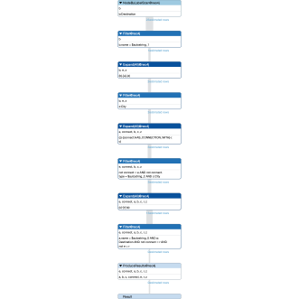
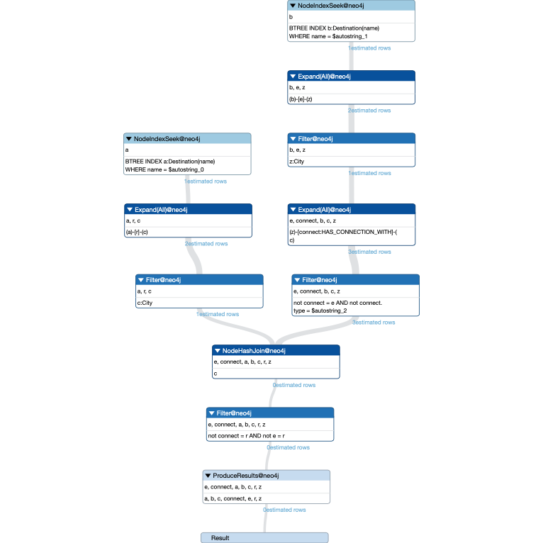

- Составить план запросы для задания `Использование neo4j`

```
EXPLAIN match (a:Destination {name:"Lara"})-[r]-(c:City)-[connect:HAS_CONNECTION_WITH]-(z:City)-[e]-(b:Destination {name:"Kemer"}) where connect.type <> "flight" return *;
```


Теперь создадим индексы.

```
create index on for (n:HAS_CONNECTION_WITH) on (n.type);
create index dest for (n:Destination) on (n.name);
create index city for (n:City) on (n.name);
```


Количество estimated rows на каждом шаге действительно уменьшилось, причём значительно.
К сожалению, план индексы не помещается на весь экран и сделать нормальный скриншот не получилось.
А вот почему так плохо neo4j сохранил в png, я так и не понял :( 