### Домашняя работа №2: MongoDB

- Для развёртывания MongoDB я использовал доккер.
- Инициировал БД и сразу наполнил её данными через файл init.js, создав коллекцию movies и сделав построчную вставку записей из файла, приложенного к уроку.

Скриншоты из Mongo Express:
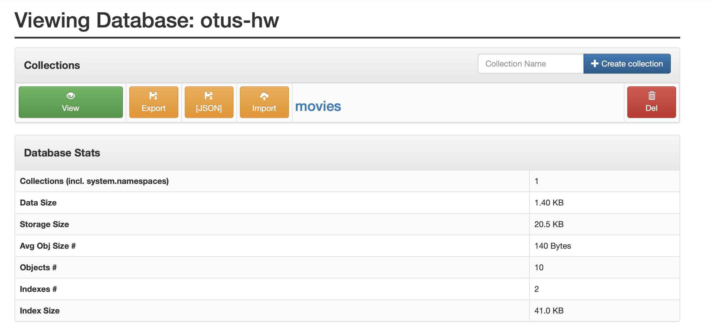
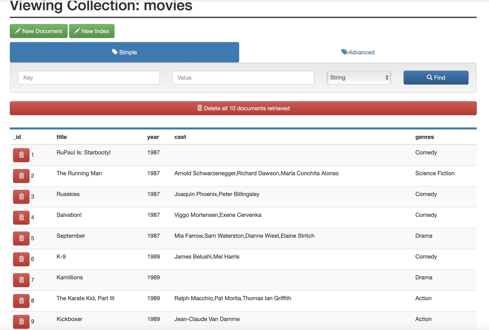

- Затем вошёл через в командную строку доккер-контейнера

- Выполнил команду show dbs
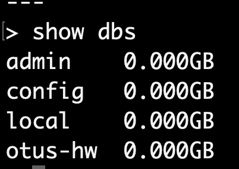

- Затем сделал вставку ещё 6 записей из файла с командами, прикреплённого к уроку
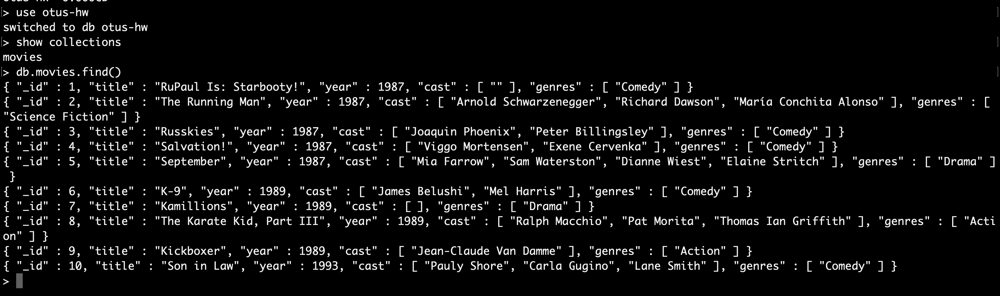
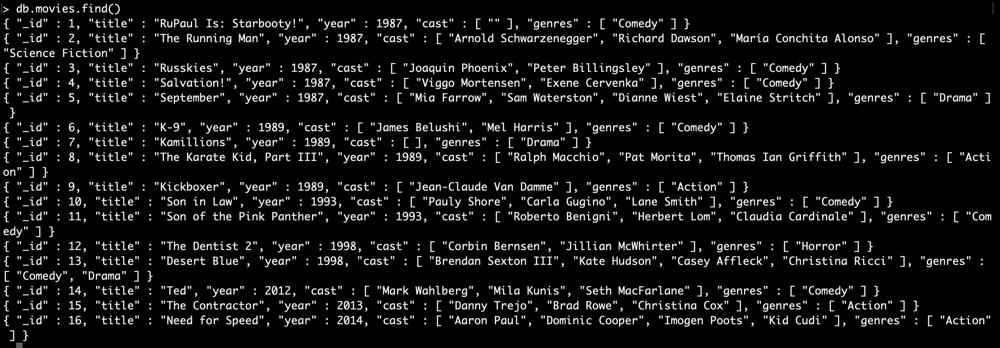

- Сделал несколько запросов на поиск данных
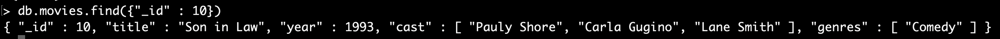
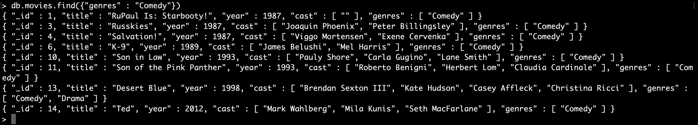
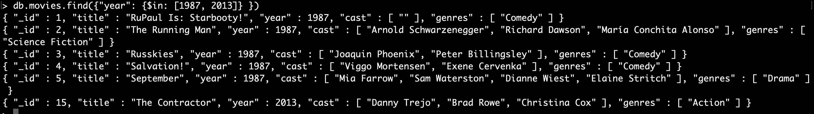

- Сделал несколько запросов на обновление данных

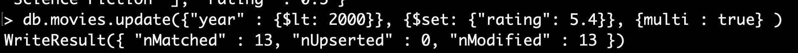
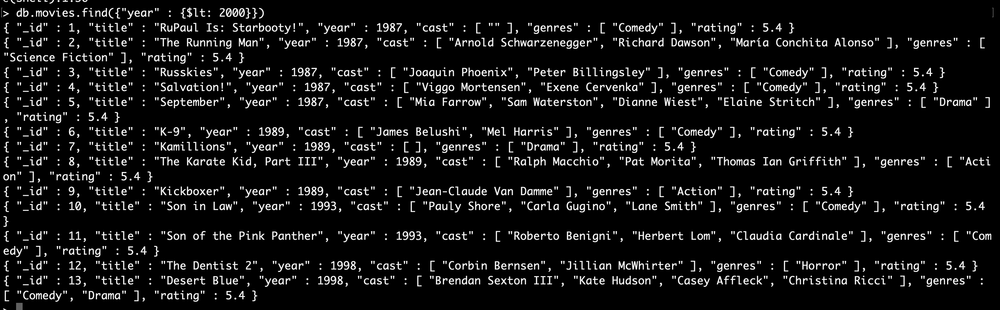

## Создание индекса и оценка производительности поска в MongoDB

Для данной задачи я использовал датасе jeopardy. Сначала загрузил его на локальную машину, а затем скопировал в контейнер с mongo. После чего ипортировал данный датасет в базу данных.
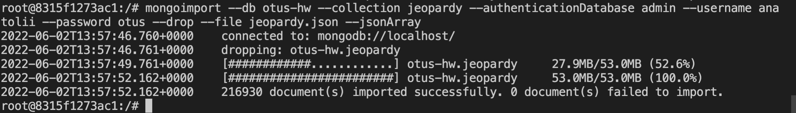

Посмотрев на пять строк из данного датасета, я подумал, что можно было бы посмотреть на производительность поиска по категории. 
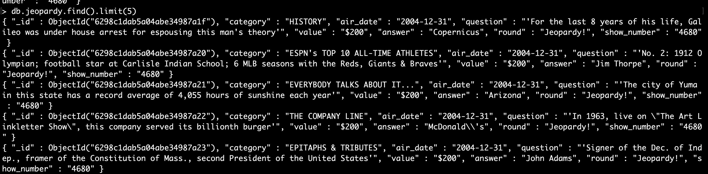

Я измерил производительность, добавив метод *.explain("executionStats")* к своему поисковому запросу. Результат поиска по категории бех индекса выдал следущую информацию. 
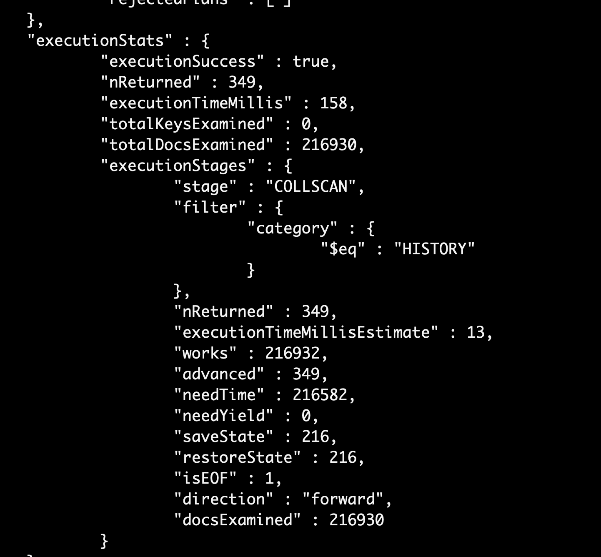

После, я создал индекс.
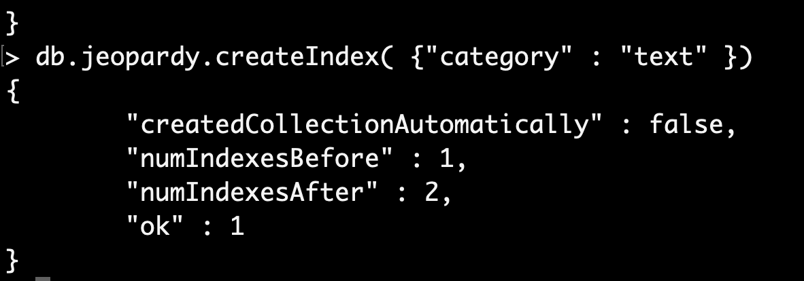

Такой же поисковый запрос выдал уже следующую информацию. 
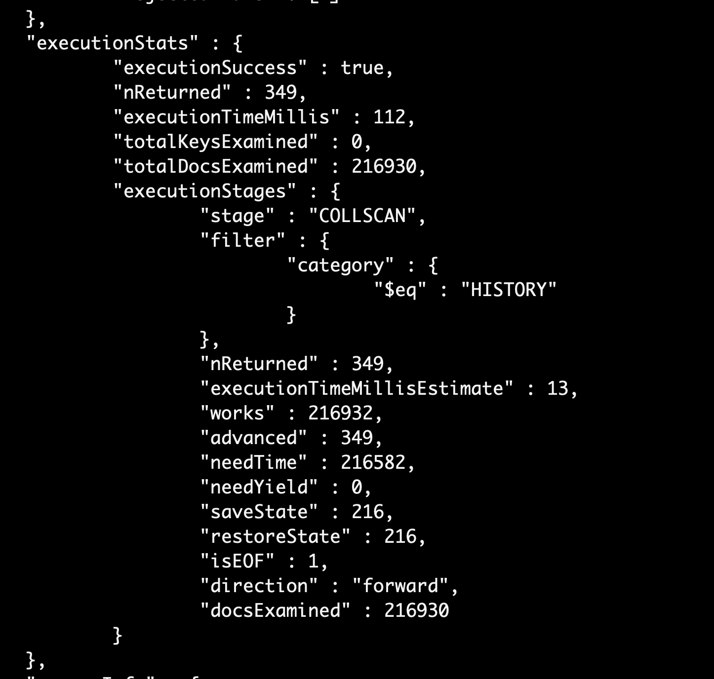

Как можно видеть, поиск по проиндексированной категори стал быстрее.