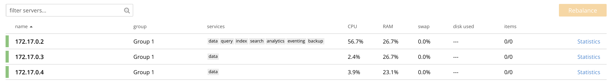
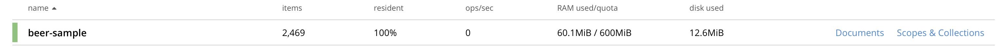
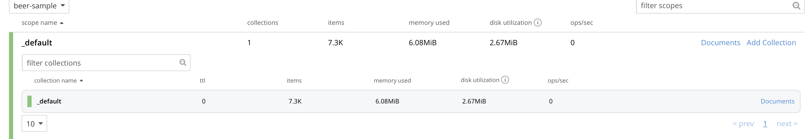
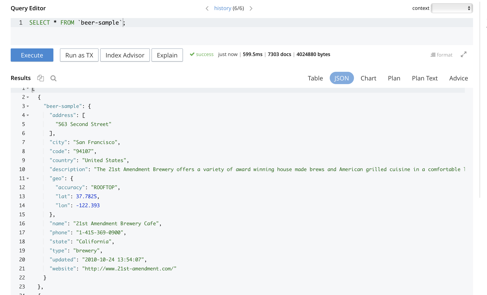
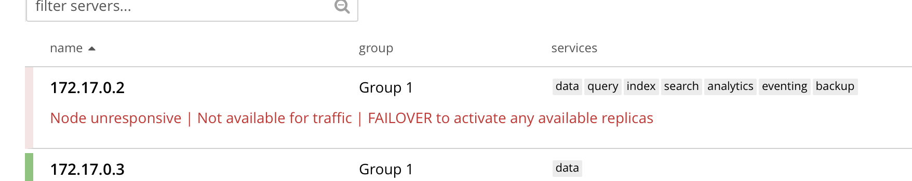
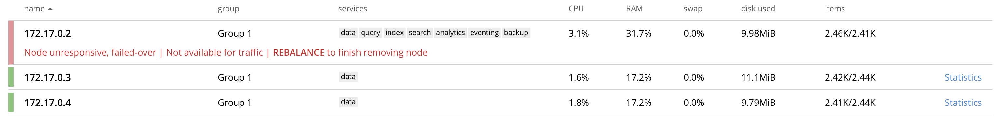
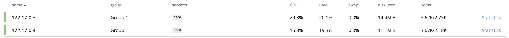
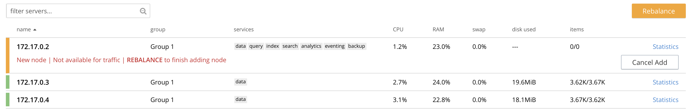
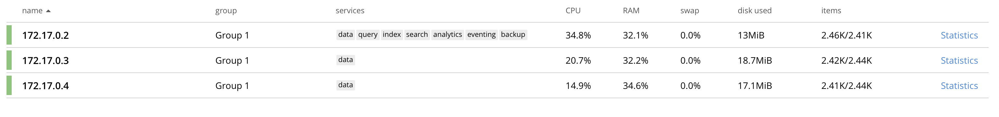

# Домашнее задание №4: Couchbase

Сначала запустим три доккер-контейнера, как указано на оффициальном сайте

```
docker run -d --name db1 couchbase

docker run -d --name db2 couchbase

docker run -d --name db3 -p 8091-8096:8091-8096 -p 11210-11211:11210-11211 couchbase
```

Далее, посмотрим ip адреса каждого из контейнеров при помощи команды:

```
docker inspect --format '{{ .NetworkSettings.IPAddress }}' <container name>
```

Контейнеры db1, db2, db3 имеют адреса 172.17.0.2, 172.17.0.3, 172.17.0.4 соответственно

Затем настроим кластер, добавив в него серверы.


После используем сэмпл данные, я выберу набор beer.


Выполним простой селект на тестовом наборе данных.

Теперь проверим отказоустойчивость, остановив один из контейнеров.


Теперь произведём ребалансировку.

Посмотрим, что будет, если опять запустить остановленный контейнер.
Couchbase не увидел ноду сразу, я добавил её вручную.

Теперь сделаем ребалансировку.

