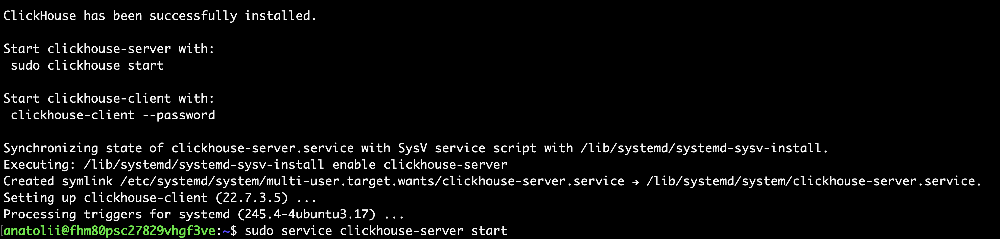
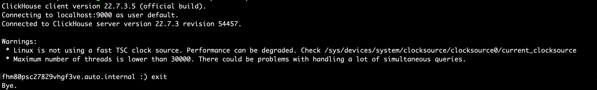
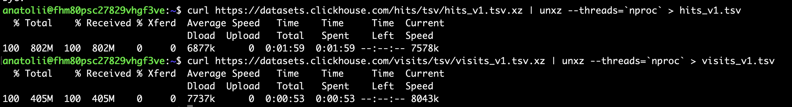
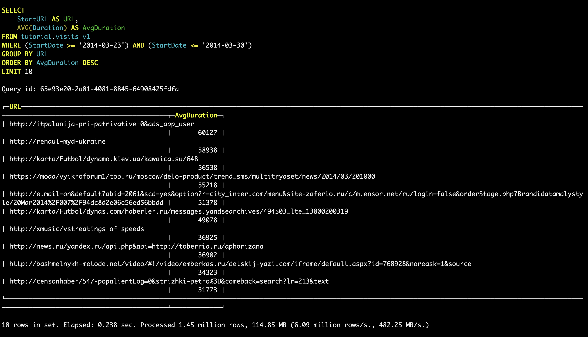
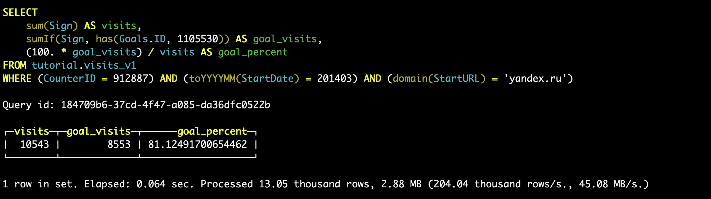
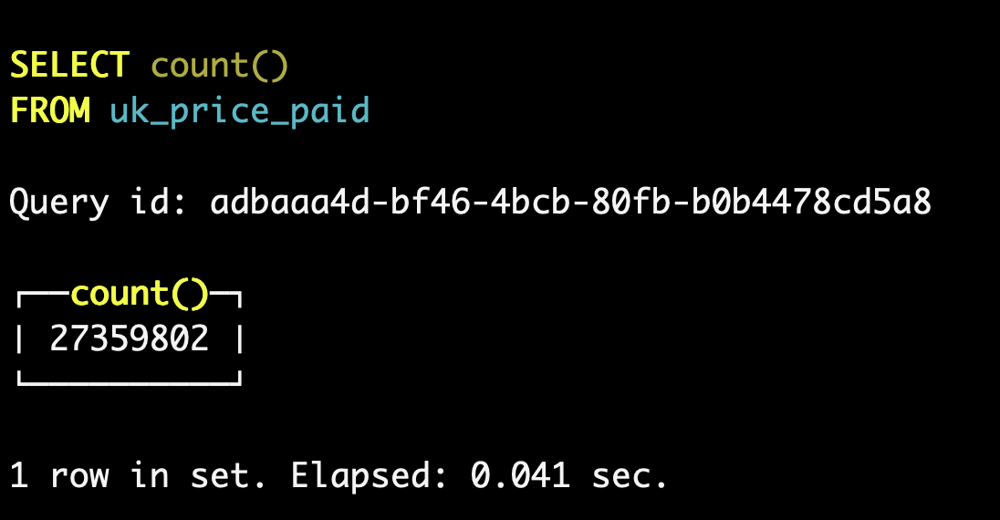
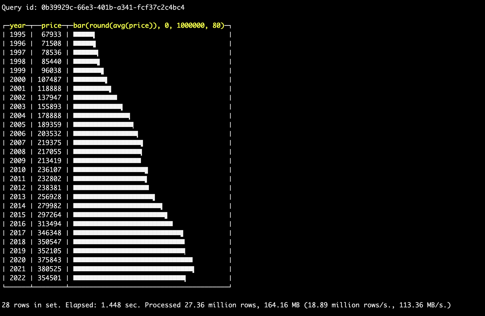
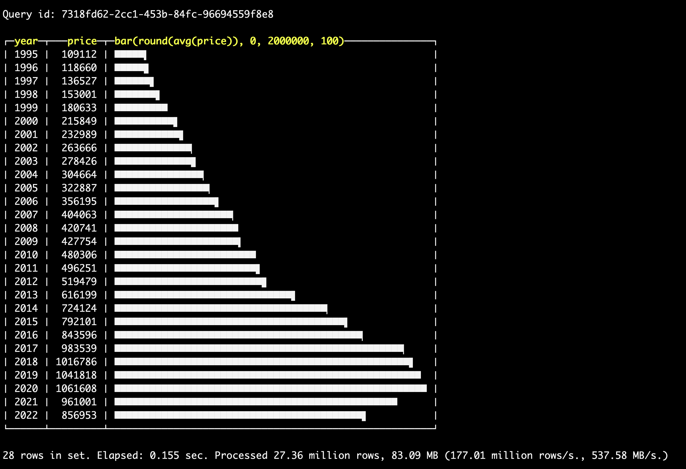
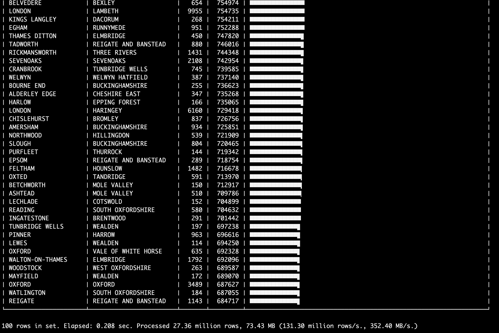

# Домашняя робота №5: Cllickhouse

Работа будет делаться в `Yandex.Cloud` на виртуальной машине - 2 ядра и 4ГБ RAM.

- 1. Установим Clickhouse на убунту как указано в тюториале.

```
sudo apt-get install -y apt-transport-https ca-certificates dirmngr
sudo apt-key adv --keyserver hkp://keyserver.ubuntu.com:80 --recv 8919F6BD2B48D754

echo "deb https://packages.clickhouse.com/deb stable main" | sudo tee \
    /etc/apt/sources.list.d/clickhouse.list
sudo apt-get update

sudo apt-get install -y clickhouse-server clickhouse-client

sudo service clickhouse-server start
clickhouse-client # or "clickhouse-client --password" if you've set up a password.
```
Как мы видим, Clickhouse сервер и клиент работают.



- 2. Теперь импортируем тестовый датасет.

```
curl https://datasets.clickhouse.com/hits/tsv/hits_v1.tsv.xz | unxz --threads=`nproc` > hits_v1.tsv

curl https://datasets.clickhouse.com/visits/tsv/visits_v1.tsv.xz | unxz --threads=`nproc` > visits_v1.tsv
```



Создадим базу данных `tutorial`

```
clickhouse-client --query "CREATE DATABASE IF NOT EXISTS tutorial"
```

Затем создадим таблицы в базе, подключившись через клиент.

```
CREATE TABLE tutorial.hits_v1
(
    `WatchID` UInt64,
    `JavaEnable` UInt8,
    `Title` String,
    `GoodEvent` Int16,
    `EventTime` DateTime,
    `EventDate` Date,
    `CounterID` UInt32,
    `ClientIP` UInt32,
    `ClientIP6` FixedString(16),
    `RegionID` UInt32,
    `UserID` UInt64,
    `CounterClass` Int8,
    `OS` UInt8,
    `UserAgent` UInt8,
    `URL` String,
    `Referer` String,
    `URLDomain` String,
    `RefererDomain` String,
    `Refresh` UInt8,
    `IsRobot` UInt8,
    `RefererCategories` Array(UInt16),
    `URLCategories` Array(UInt16),
    `URLRegions` Array(UInt32),
    `RefererRegions` Array(UInt32),
    `ResolutionWidth` UInt16,
    `ResolutionHeight` UInt16,
    `ResolutionDepth` UInt8,
    `FlashMajor` UInt8,
    `FlashMinor` UInt8,
    `FlashMinor2` String,
    `NetMajor` UInt8,
    `NetMinor` UInt8,
    `UserAgentMajor` UInt16,
    `UserAgentMinor` FixedString(2),
    `CookieEnable` UInt8,
    `JavascriptEnable` UInt8,
    `IsMobile` UInt8,
    `MobilePhone` UInt8,
    `MobilePhoneModel` String,
    `Params` String,
    `IPNetworkID` UInt32,
    `TraficSourceID` Int8,
    `SearchEngineID` UInt16,
    `SearchPhrase` String,
    `AdvEngineID` UInt8,
    `IsArtifical` UInt8,
    `WindowClientWidth` UInt16,
    `WindowClientHeight` UInt16,
    `ClientTimeZone` Int16,
    `ClientEventTime` DateTime,
    `SilverlightVersion1` UInt8,
    `SilverlightVersion2` UInt8,
    `SilverlightVersion3` UInt32,
    `SilverlightVersion4` UInt16,
    `PageCharset` String,
    `CodeVersion` UInt32,
    `IsLink` UInt8,
    `IsDownload` UInt8,
    `IsNotBounce` UInt8,
    `FUniqID` UInt64,
    `HID` UInt32,
    `IsOldCounter` UInt8,
    `IsEvent` UInt8,
    `IsParameter` UInt8,
    `DontCountHits` UInt8,
    `WithHash` UInt8,
    `HitColor` FixedString(1),
    `UTCEventTime` DateTime,
    `Age` UInt8,
    `Sex` UInt8,
    `Income` UInt8,
    `Interests` UInt16,
    `Robotness` UInt8,
    `GeneralInterests` Array(UInt16),
    `RemoteIP` UInt32,
    `RemoteIP6` FixedString(16),
    `WindowName` Int32,
    `OpenerName` Int32,
    `HistoryLength` Int16,
    `BrowserLanguage` FixedString(2),
    `BrowserCountry` FixedString(2),
    `SocialNetwork` String,
    `SocialAction` String,
    `HTTPError` UInt16,
    `SendTiming` Int32,
    `DNSTiming` Int32,
    `ConnectTiming` Int32,
    `ResponseStartTiming` Int32,
    `ResponseEndTiming` Int32,
    `FetchTiming` Int32,
    `RedirectTiming` Int32,
    `DOMInteractiveTiming` Int32,
    `DOMContentLoadedTiming` Int32,
    `DOMCompleteTiming` Int32,
    `LoadEventStartTiming` Int32,
    `LoadEventEndTiming` Int32,
    `NSToDOMContentLoadedTiming` Int32,
    `FirstPaintTiming` Int32,
    `RedirectCount` Int8,
    `SocialSourceNetworkID` UInt8,
    `SocialSourcePage` String,
    `ParamPrice` Int64,
    `ParamOrderID` String,
    `ParamCurrency` FixedString(3),
    `ParamCurrencyID` UInt16,
    `GoalsReached` Array(UInt32),
    `OpenstatServiceName` String,
    `OpenstatCampaignID` String,
    `OpenstatAdID` String,
    `OpenstatSourceID` String,
    `UTMSource` String,
    `UTMMedium` String,
    `UTMCampaign` String,
    `UTMContent` String,
    `UTMTerm` String,
    `FromTag` String,
    `HasGCLID` UInt8,
    `RefererHash` UInt64,
    `URLHash` UInt64,
    `CLID` UInt32,
    `YCLID` UInt64,
    `ShareService` String,
    `ShareURL` String,
    `ShareTitle` String,
    `ParsedParams` Nested(
        Key1 String,
        Key2 String,
        Key3 String,
        Key4 String,
        Key5 String,
        ValueDouble Float64),
    `IslandID` FixedString(16),
    `RequestNum` UInt32,
    `RequestTry` UInt8
)
ENGINE = MergeTree()
PARTITION BY toYYYYMM(EventDate)
ORDER BY (CounterID, EventDate, intHash32(UserID))
SAMPLE BY intHash32(UserID)
```

```
CREATE TABLE tutorial.visits_v1
(
    `CounterID` UInt32,
    `StartDate` Date,
    `Sign` Int8,
    `IsNew` UInt8,
    `VisitID` UInt64,
    `UserID` UInt64,
    `StartTime` DateTime,
    `Duration` UInt32,
    `UTCStartTime` DateTime,
    `PageViews` Int32,
    `Hits` Int32,
    `IsBounce` UInt8,
    `Referer` String,
    `StartURL` String,
    `RefererDomain` String,
    `StartURLDomain` String,
    `EndURL` String,
    `LinkURL` String,
    `IsDownload` UInt8,
    `TraficSourceID` Int8,
    `SearchEngineID` UInt16,
    `SearchPhrase` String,
    `AdvEngineID` UInt8,
    `PlaceID` Int32,
    `RefererCategories` Array(UInt16),
    `URLCategories` Array(UInt16),
    `URLRegions` Array(UInt32),
    `RefererRegions` Array(UInt32),
    `IsYandex` UInt8,
    `GoalReachesDepth` Int32,
    `GoalReachesURL` Int32,
    `GoalReachesAny` Int32,
    `SocialSourceNetworkID` UInt8,
    `SocialSourcePage` String,
    `MobilePhoneModel` String,
    `ClientEventTime` DateTime,
    `RegionID` UInt32,
    `ClientIP` UInt32,
    `ClientIP6` FixedString(16),
    `RemoteIP` UInt32,
    `RemoteIP6` FixedString(16),
    `IPNetworkID` UInt32,
    `SilverlightVersion3` UInt32,
    `CodeVersion` UInt32,
    `ResolutionWidth` UInt16,
    `ResolutionHeight` UInt16,
    `UserAgentMajor` UInt16,
    `UserAgentMinor` UInt16,
    `WindowClientWidth` UInt16,
    `WindowClientHeight` UInt16,
    `SilverlightVersion2` UInt8,
    `SilverlightVersion4` UInt16,
    `FlashVersion3` UInt16,
    `FlashVersion4` UInt16,
    `ClientTimeZone` Int16,
    `OS` UInt8,
    `UserAgent` UInt8,
    `ResolutionDepth` UInt8,
    `FlashMajor` UInt8,
    `FlashMinor` UInt8,
    `NetMajor` UInt8,
    `NetMinor` UInt8,
    `MobilePhone` UInt8,
    `SilverlightVersion1` UInt8,
    `Age` UInt8,
    `Sex` UInt8,
    `Income` UInt8,
    `JavaEnable` UInt8,
    `CookieEnable` UInt8,
    `JavascriptEnable` UInt8,
    `IsMobile` UInt8,
    `BrowserLanguage` UInt16,
    `BrowserCountry` UInt16,
    `Interests` UInt16,
    `Robotness` UInt8,
    `GeneralInterests` Array(UInt16),
    `Params` Array(String),
    `Goals` Nested(
        ID UInt32,
        Serial UInt32,
        EventTime DateTime,
        Price Int64,
        OrderID String,
        CurrencyID UInt32),
    `WatchIDs` Array(UInt64),
    `ParamSumPrice` Int64,
    `ParamCurrency` FixedString(3),
    `ParamCurrencyID` UInt16,
    `ClickLogID` UInt64,
    `ClickEventID` Int32,
    `ClickGoodEvent` Int32,
    `ClickEventTime` DateTime,
    `ClickPriorityID` Int32,
    `ClickPhraseID` Int32,
    `ClickPageID` Int32,
    `ClickPlaceID` Int32,
    `ClickTypeID` Int32,
    `ClickResourceID` Int32,
    `ClickCost` UInt32,
    `ClickClientIP` UInt32,
    `ClickDomainID` UInt32,
    `ClickURL` String,
    `ClickAttempt` UInt8,
    `ClickOrderID` UInt32,
    `ClickBannerID` UInt32,
    `ClickMarketCategoryID` UInt32,
    `ClickMarketPP` UInt32,
    `ClickMarketCategoryName` String,
    `ClickMarketPPName` String,
    `ClickAWAPSCampaignName` String,
    `ClickPageName` String,
    `ClickTargetType` UInt16,
    `ClickTargetPhraseID` UInt64,
    `ClickContextType` UInt8,
    `ClickSelectType` Int8,
    `ClickOptions` String,
    `ClickGroupBannerID` Int32,
    `OpenstatServiceName` String,
    `OpenstatCampaignID` String,
    `OpenstatAdID` String,
    `OpenstatSourceID` String,
    `UTMSource` String,
    `UTMMedium` String,
    `UTMCampaign` String,
    `UTMContent` String,
    `UTMTerm` String,
    `FromTag` String,
    `HasGCLID` UInt8,
    `FirstVisit` DateTime,
    `PredLastVisit` Date,
    `LastVisit` Date,
    `TotalVisits` UInt32,
    `TraficSource` Nested(
        ID Int8,
        SearchEngineID UInt16,
        AdvEngineID UInt8,
        PlaceID UInt16,
        SocialSourceNetworkID UInt8,
        Domain String,
        SearchPhrase String,
        SocialSourcePage String),
    `Attendance` FixedString(16),
    `CLID` UInt32,
    `YCLID` UInt64,
    `NormalizedRefererHash` UInt64,
    `SearchPhraseHash` UInt64,
    `RefererDomainHash` UInt64,
    `NormalizedStartURLHash` UInt64,
    `StartURLDomainHash` UInt64,
    `NormalizedEndURLHash` UInt64,
    `TopLevelDomain` UInt64,
    `URLScheme` UInt64,
    `OpenstatServiceNameHash` UInt64,
    `OpenstatCampaignIDHash` UInt64,
    `OpenstatAdIDHash` UInt64,
    `OpenstatSourceIDHash` UInt64,
    `UTMSourceHash` UInt64,
    `UTMMediumHash` UInt64,
    `UTMCampaignHash` UInt64,
    `UTMContentHash` UInt64,
    `UTMTermHash` UInt64,
    `FromHash` UInt64,
    `WebVisorEnabled` UInt8,
    `WebVisorActivity` UInt32,
    `ParsedParams` Nested(
        Key1 String,
        Key2 String,
        Key3 String,
        Key4 String,
        Key5 String,
        ValueDouble Float64),
    `Market` Nested(
        Type UInt8,
        GoalID UInt32,
        OrderID String,
        OrderPrice Int64,
        PP UInt32,
        DirectPlaceID UInt32,
        DirectOrderID UInt32,
        DirectBannerID UInt32,
        GoodID String,
        GoodName String,
        GoodQuantity Int32,
        GoodPrice Int64),
    `IslandID` FixedString(16)
)
ENGINE = CollapsingMergeTree(Sign)
PARTITION BY toYYYYMM(StartDate)
ORDER BY (CounterID, StartDate, intHash32(UserID), VisitID)
SAMPLE BY intHash32(UserID)
```

Теперь импортируем загруженные данные в базу.

```
clickhouse-client --query "INSERT INTO tutorial.hits_v1 FORMAT TSV" --max_insert_block_size=100000 < hits_v1.tsv

clickhouse-client --query "INSERT INTO tutorial.visits_v1 FORMAT TSV" --max_insert_block_size=100000 < visits_v1.tsv
```

Оптимизируем таблицы

```
clickhouse-client --query "OPTIMIZE TABLE tutorial.hits_v1 FINAL"

clickhouse-client --query "OPTIMIZE TABLE tutorial.visits_v1 FINAL"
```

Теперь сделаем пару запросов, чтобы оценить скорость выполнения.



- 3. Загрузим одной из тестовых БД

Я выбрал [UK Property Price Paid](https://clickhouse.com/docs/en/getting-started/example-datasets/uk-price-paid)

Скачаем датасет

```
wget http://prod.publicdata.landregistry.gov.uk.s3-website-eu-west-1.amazonaws.com/pp-complete.csv
```

Создадим таблицу в базе

```
CREATE TABLE uk_price_paid
(
    price UInt32,
    date Date,
    postcode1 LowCardinality(String),
    postcode2 LowCardinality(String),
    type Enum8('terraced' = 1, 'semi-detached' = 2, 'detached' = 3, 'flat' = 4, 'other' = 0),
    is_new UInt8,
    duration Enum8('freehold' = 1, 'leasehold' = 2, 'unknown' = 0),
    addr1 String,
    addr2 String,
    street LowCardinality(String),
    locality LowCardinality(String),
    town LowCardinality(String),
    district LowCardinality(String),
    county LowCardinality(String),
    category UInt8
) ENGINE = MergeTree ORDER BY (postcode1, postcode2, addr1, addr2);
```

Обработаем данные и зальём их в базу

```
clickhouse-local --input-format CSV --structure '
    uuid String,
    price UInt32,
    time DateTime,
    postcode String,
    a String,
    b String,
    c String,
    addr1 String,
    addr2 String,
    street String,
    locality String,
    town String,
    district String,
    county String,
    d String,
    e String
' --query "
    WITH splitByChar(' ', postcode) AS p
    SELECT
        price,
        toDate(time) AS date,
        p[1] AS postcode1,
        p[2] AS postcode2,
        transform(a, ['T', 'S', 'D', 'F', 'O'], ['terraced', 'semi-detached', 'detached', 'flat', 'other']) AS type,
        b = 'Y' AS is_new,
        transform(c, ['F', 'L', 'U'], ['freehold', 'leasehold', 'unknown']) AS duration,
        addr1,
        addr2,
        street,
        locality,
        town,
        district,
        county,
        d = 'B' AS category
    FROM table" --date_time_input_format best_effort < pp-complete.csv | clickhouse-client --query "INSERT INTO uk_price_paid FORMAT TSV"
```

Проверим, есть ли данные в БД



Теперь сделаем несколько запросов, чтобы посмотреть скорость выполнения

```
SELECT toYear(date) AS year, round(avg(price)) AS price, bar(price, 0, 1000000, 80) FROM uk_price_paid GROUP BY year ORDER BY year;
```

```
SELECT toYear(date) AS year, round(avg(price)) AS price, bar(price, 0, 2000000, 100) FROM uk_price_paid WHERE town = 'LONDON' GROUP BY year ORDER BY year;
```

```
SELECT
    town,
    district,
    count() AS c,
    round(avg(price)) AS price,
    bar(price, 0, 5000000, 100)
FROM uk_price_paid
WHERE date >= '2020-01-01'
GROUP BY
    town,
    district
HAVING c >= 100
ORDER BY price DESC
LIMIT 100;
```
